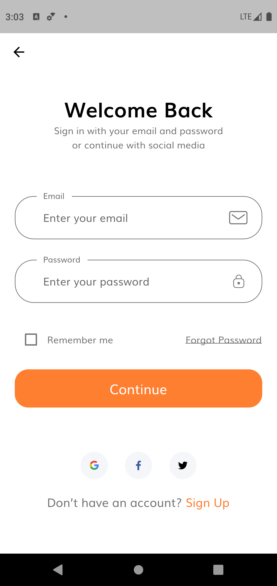
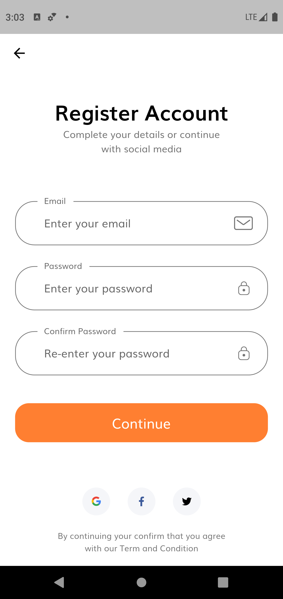

# E-Commerce App For CS308 Project

After the signup or login page process you can start to look up sneaker and if you like any of them you can add it to your favorite list. You can add the product your shopping cart and order it easliy.

**Packages we are using:**

- flutter_svg: [link](https://pub.dev/packages/flutter_svg)

## Screens it contains:

=> Welcome Page

=> Login

=> Forgot Password

=> Sign Up

=> Complete Profile

=> OTP Verification

=> Home Page

=> Product Details

=> Order

=> Profile (added)

=> Bottom Navigation Bar (added)

## Photos

